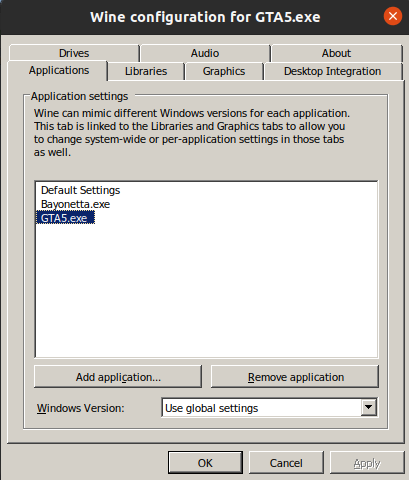
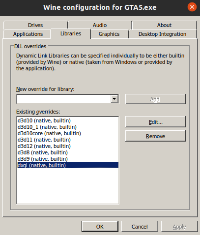
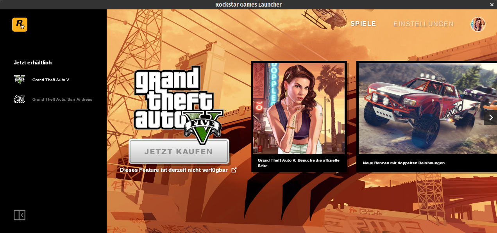

# Play GTA5 in Linux with Steam

Wine has come a long way as a windows-emulator and can even be used to play Windows games in Linux. However, for some games, its not
an easy setup process, specifically GTA5 and its stupid %$@#&%^ launcher.

These steps outline how to install and play a Windows executable GTA5 in Linux(tested on Ubuntu20.04LTS) using Wine & Steam. They are not exhaustive and a work-in-progress and some of these instructions might not be in the right order yet (for the most part its quite accurate, but YMMV). So read before use and understand what you need to do before venturing out too far. Always create backups when necessary.


## 1. Install Nvidia Driver (or AMD driver)
```bash
$ sudo apt-get install nvidia-390 && sudo reboot now
```
Check that Nvidia X Server Settings recognizes the GPU with the new installed driver


## 2. Install Wine, Winetricks
- Install Wine-64 bit
```bash
$ sudo apt install wine64  # we need 64-bit for GTA5
```
- Install Winetricks and corefronts
```bash
$ wget  https://raw.githubusercontent.com/Winetricks/winetricks/master/src/winetricks 
$ chmod +x winetricks
$ sudo mv winetricks /usr/local/bin/.
$ winetricks corefronts vcrun6   # winetricks has a bug where `winetricks corefronts` doesn't work, so try with multiple installables
```

## 3. Install Steam
```bash
$ sudo apt-get install steam
```
- Enabled Steam Play to allow playing Windows titles in Linux: open settings -> Steam Play (left hand panel) -> Check "Enable Steam Play for supported titles".

## 4. Install Proton in Steam compatibility-tools directory (required for Steam Play)
```bash
$ wget https://github.com/GloriousEggroll/proton-ge-custom/releases/download/5.8-GE-2-MF/Proton-5.8-GE-2-MF.tar.gz ~/Downloads/.
$ mkdir -p ~/.local/share/Steam/compatibilitytools.d
$ tar xvf ~/Downloads/Proton-5.8-GE-2-MF.tar.gz -C ~/.local/share/Steam/compatibilitytools.d/
```

## 5. Install Protontricks
```bash
$ sudo apt install python3-pip python3-setuptools python3-venv
$ python3 -m pip install --user pipx
$ ~/.local/bin/pipx ensurepath
$ pipx install protontricks
$ pipx upgrade protontricks
```

## 6. Install GTA5 on Steam
- Download and install GTA5 on Steam; right-click on game, click Properties:
  a. Check "Force the use of a specific Steam Play Compatibility tool"
  b. select the Proton build that was downloaded recently (5.8-GE-2-MF)
  c. Click on "SET LAUNCH OPTIONS..." and enter the following:
```bash
DXVF_CONFIG_FILE=/home/<user>/gta_dxvf.conf PROTON_USE_WINED3D=1 WINEDLLOVERRIDES=winedbg.exe=d %command%
```
NOTE: Replace `<user>` with your unix username

> You could also copy `~/.steam/steam/compatibilitytools.d/Proton-5.8-GE-2-MF/user_settings.sample.py` to `user_settings.py` and uncomment the settings as desired for your gameplay (these are most of the same ones that are in the launch options above).


## 7. Backup GTA5 vanilla files
Backup the freshly downloaded GTA5 game directly files somewhere where you won't forget about it, like our Desktop:
```bash
$ cp -R ~/.steam/steam/steamapps/common/Grand Theft Auto V/ ~/Desktop/.
```
This will help us restore from our hacks if they go wrong, so avoids downloading and installing the game each time. So anytime any of the steps from this point on go wrong, copy the backup over to the above directory where it was copied from and you should be restored to this step.


## 8. Install DXVF
Contains a bunch of Windows DLLs (32 and 64bit) that replace the Direct3D 9/10/11 dlls with ones that are compatible with Wine (could be slower on your system, or faster, YMMV)

- Fetch the appropriate version of DXVF release from https://github.com/doitsujin/dxvk/releases page as it fits your driver. 
> Choose wisely the right version that's suitable with your video driver. In my case, I have a Nvidia GTX1060 using driver v390.132, which works uptil DXVF version 1.5.1. So for me, the latest releases won't work b/c Nvidia driver 390.132 is blacklisted in later releases. Using the wrong DXVF can result in errors, so always check the logs created in the game directory and double-check the release-notes for DXVF to see compatibility.

- Extract DXVF and install x64 dlls:
```bash
$ tar xvf ~/Downloads/dxvk-1.5.1.tar.gz
$ cd dxvk-1.5.1
$ ./setup_dxvk.sh install --without-dxgi  # Do not install DXVK's DXGI implementation and use the one provided by wine instead. This is necessary for both vkd3d and DXVK to work within the same wine prefix.
```
- Also extract DXVF x64 dlls to game directory `~/.steam/steam/steamapps/common/Grand Theft Auto V`:
```bash
$ cp ~/Downloads/dxvk-1.5.1/x64/d3d*.dll ~/.steam/steam/steamapps/common/Grand Theft Auto V/.
```

- Configure Wine with new dlls to use native, then builtin (default override) so open it up with following command:
```bash
$ WINEPREFIX=/home/<user>/.steam/steam/steamapps/compatdata/271590/pfx winecfg
```


Under "Applications" tab, click "Add application" and navigate over to the game directory and select `GTA5.exe`. Then with `GTA5.exe` selected, click the "Libraries" tab and in the panel "Existing overrides", edit each of the direct-3d dlls added by the `setup_dxvk.sh` installer (d3d10core, d3d11, d3d9 dxgi) and set the "load order" to "native then builtin". If they aren't added, then manually select them from the dropdown above and add them here.



- Create a `~/gta_dxvf.conf` file with following contents:
```conf
dxgi.customDeviceId = E366
dxgi.customVendorId = 1002
```
NOTE: This file `gta_dxvf.conf` is what's referenced in Step 6 for the GTA5 launch options in Steam.


## 9. Fix Rockstar Launcher
- Start GTA5 in Steam and wait for Rockstart-Launcher to hang at "installing"

Now, close the launcher: we'll fix this issue now. At least starting the launcher created the basic wine directories for c_drive, etc. So we'll use that and manually install the launchers ourselves. Sad, but Rockstar sucks at addressing issues with Wine, so....here we are.

- In a terminal, extract the contents of the Rockstar Game Launcher, and replace `<user>` with your own username below:
```bash
$ file-roller ~/.steam/steam/steamapps/common/Grand Theft Auto V/Installers/Rockstar-Games-Launcher.exe --extract-to=/home/<user>/.local/share/Steam/steamapps/compatdata/271590/pfx/drive_c/Program\ Files/Rockstar\ Games/Launcher/
```

- Copy the `Social-Club-Setup.exe` from Steam installation of GTA5 over to Wine installation of GTA5:
```bash
$ cp ~/.steam/steam/steamapps/common/Grand Theft Auto V/Installers/Social-Club-Setup.exe ~/.local/share/Steam/steamapps/compatdata/271590/pfx/drive_c/Program\ Files/Rockstar\ Games/Launcher/Redistributables/SocialClub/.
``` 

- Now start the launcher and you can then register/login for online play. Once done, close the launcher:
```bash
$ protontricks -c 'wine ~/.local/share/Steam/steamapps/compatdata/271590/pfx/drive_c/Program\ Files/Rockstar\ Games/Launcher/Launcher.exe' 271590
```



- Now we've successfully installed the Social-Club, configued it and are done with it! This should now allow the game to start and also play online!!


## 10: Start and play GTA5 from Steam!
Start GTA5 in Steam now and you shouldn't get the Game Launcher window hung up anymore and lead you straight into the game. Enjoy!!


NOTE: If the Rockstar-Game-Launcher gets an online update, then you'd have to repeat the steps from 9. again to get past the annoying launcher again
